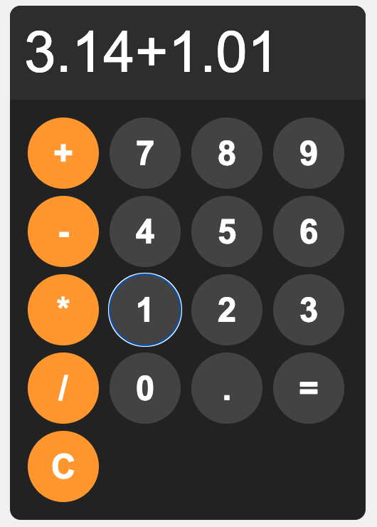
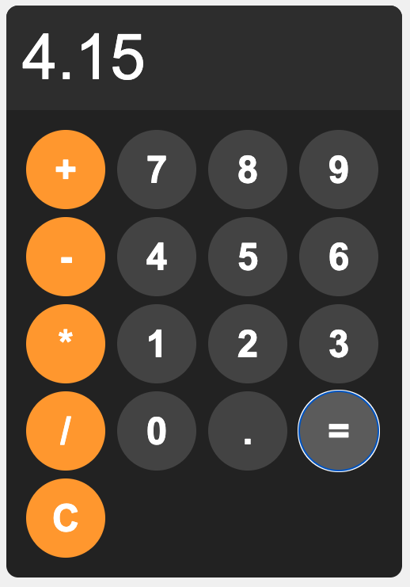

# JavaScript Calculator

A sleek web-based calculator built with **HTML**, **CSS**, and **JavaScript**. Features a dark theme with orange operator buttons, circular keys, and basic arithmetic operations with error handling.

## Features
- ➕ Basic arithmetic operations (addition, subtraction, multiplication, division)
- 🔢 Decimal point support
- 🎨 Dark theme with orange accent for operators
- ⭕ Circular button design with smooth hover/active states
- ❌ Clear function to reset display
- ⚠️ Error handling for invalid expressions
- 📱 4×4 grid layout with responsive design

## Requirements
- Any modern web browser (Chrome, Firefox, Safari, Edge)
- No external dependencies or libraries needed

## Project structure
```
.
├── calculator.html
├── calculator.css
└── calculator.js
```

## Screenshots



* The calculator interface features:
  - Dark gray/black body (`hsl(0, 0%, 15%)`) with rounded corners
  - Large display area (5rem font) with left-aligned text
  - 4×4 grid of circular buttons (100px diameter)
  - Number buttons in dark gray (`hsl(0, 0%, 30%)`)
  - Operator buttons (+, -, *, /, C) in orange (`hsl(35, 100%, 55%)`)
  - Smooth hover and active state transitions
  - Centered on light gray background (`hsl(0, 0%, 95%)`)

## Usage
1. Open `calculator.html` in your web browser
2. Click number buttons (0-9) to enter digits
3. Click operator buttons (+, -, *, /) to perform operations
4. Click the decimal point (.) for decimal numbers
5. Click **=** to calculate the result
6. Click **C** to clear the display

## Functionality

### Three core functions:

**1. appendToDisplay(input)**
- Appends the clicked button's value to the display
- Builds the mathematical expression as you type
```javascript
display.value += input;
```

**2. clearDisplay()**
- Clears all input from the display
- Resets calculator to initial state
```javascript
display.value = "";
```

**3. calculate()**
- Evaluates the mathematical expression using `eval()`
- Uses try/catch block to handle errors gracefully
- Displays "Error" for invalid expressions (e.g., "3.14 +")
```javascript
try {
    display.value = eval(display.value);
} catch(error) {
    display.value = "Error";
}
```

## Button layout
```
+  7  8  9
-  4  5  6
*  1  2  3
/  0  .  =
C
```
Note: The layout in the grid is arranged differently in the HTML for styling purposes.

## Customize
- **Color scheme**: Modify HSL values in `calculator.css`
  - Body background: `hsl(0, 0%, 95%)`
  - Calculator body: `hsl(0, 0%, 15%)`
  - Display: `hsl(0, 0%, 20%)`
  - Number buttons: `hsl(0, 0%, 30%)`
  - Operator buttons: `hsl(35, 100%, 55%)`
- **Button size**: Adjust `width` and `height` (currently 100px)
- **Display font size**: Change `font-size: 5rem;` in `#display`
- **Border radius**: Modify `border-radius: 50px;` for button shape
- **Grid layout**: Change `grid-template-columns: repeat(4, 1fr);` for different layouts

## Error handling
The calculator catches and displays errors for:
- Incomplete expressions (e.g., "5 +")
- Invalid syntax (e.g., "5 * * 3")
- Division by zero attempts
- Any other malformed mathematical expressions

When an error occurs, "Error" is displayed instead of crashing.

## Notes
- Uses `eval()` to evaluate mathematical expressions
- Display is read-only to prevent manual keyboard input
- Operator buttons have distinct orange color for easy identification
- All buttons have hover (lighter) and active (even lighter) states
- Calculator is vertically and horizontally centered on the page
- Grid layout automatically handles button spacing with 10px gaps

## Security note
This calculator uses `eval()` for simplicity in educational contexts. For production applications, consider using a safer expression parser library to avoid potential security risks associated with `eval()`.

---

Happy calculating! 🧮